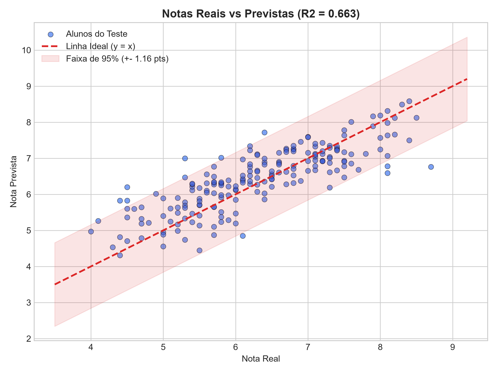
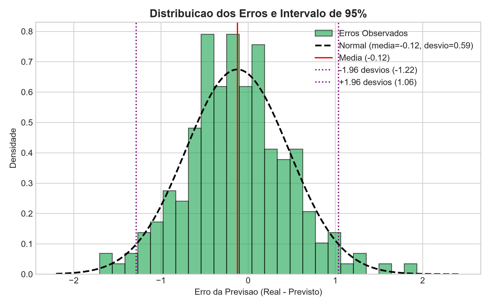
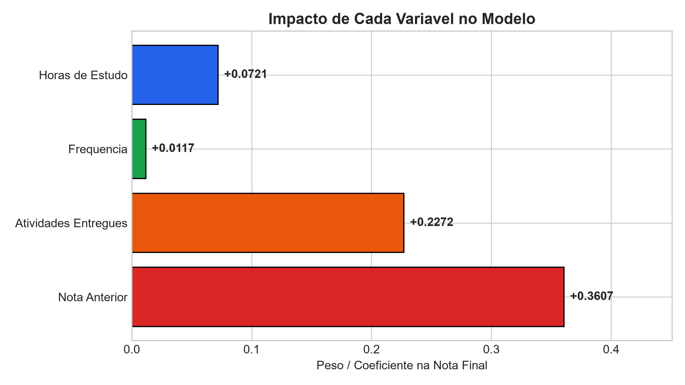
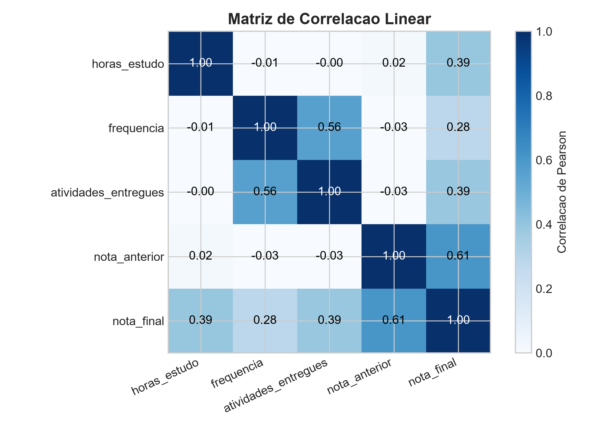

# Atividade P3: Predição de Notas de Alunos com Machine Learning

**Disciplina:** Inteligência Artificial  
**Integrantes (Dupla):** Pablo de Sousa Santos • Gabriel Messias da Silva  
**Documento para Entrega:** [`relatorio_analise.docx`](relatorio_analise.docx) (ou [`relatorio_analise.md`](relatorio_analise.md))  

---

## 1. Descrição do Problema e Base Sintética

O objetivo desta atividade é prever a **nota final** de estudantes a partir de quatro variáveis acadêmicas:
1. **Horas de estudo** semanais (`horas_estudo`): de 2.0 a 35.0 h.
2. **Frequência** escolar (`frequencia`): de 50.0% a 100.0%.
3. **Atividades entregues** (`atividades_entregues`): de 0 a 10.
4. **Nota anterior** (`nota_anterior`): de 0.0 a 10.0.

A base sintética contém **1.000 alunos** gerados no arquivo [`dados_alunos.csv`](dados_alunos.csv). A nota final alvo foi construída com ponderações pedagógicas somadas a um ruído estocástico ($\mu=0, \sigma=0.55$) para reproduzir variações humanas reais (ansiedade, cansaço, imprevistos na semana da prova).

---

## 2. Como Executar o Código

### Dependências
```bash
pip install -r requirements.txt
```

### Treinar o Modelo e Gerar os Resultados
```bash
python main.py
```

O script treina uma **Regressão Linear Múltipla** (80% treino = 800 amostras, 20% teste = 200 amostras), calcula todas as métricas no conjunto de teste e salva os gráficos na pasta `graficos/`.

### Equação Ajustada pelo Modelo:
$$\text{Nota Final} = 0.4647 + 0.0721 \cdot (\text{horas\_estudo}) + 0.0117 \cdot (\text{frequencia}) + 0.2272 \cdot (\text{atividades\_entregues}) + 0.3607 \cdot (\text{nota\_anterior})$$

---

## 3. Cálculos Estatísticos (Conjunto de Teste, $n = 200$)

| Métrica / Dimensão | Valor Calculado | Interpretação |
| :--- | :---: | :--- |
| **Média das Notas Reais** | **6.314** | Média real observada no teste |
| **Desvio Padrão Real** | **1.040** | Dispersão natural das notas |
| **Média das Notas Previstas** | **6.437** | Estimativa média do modelo |
| **Desvio Padrão Previsto** | **0.874** | Dispersão das previsões |
| **Média dos Erros (Viés / Bias)** | **-0.1232** | Próximo de zero (modelo não-viesado) |
| **Desvio Padrão dos Erros ($s_e$)** | **0.5915** | Concentração dos resíduos |
| **Erro Médio Absoluto (MAE)** | **0.4724 pontos** | Erro médio inferior a meio ponto (escala 0-10) |
| **Raiz do Erro Quadrático (RMSE)** | **0.6027 pontos** | Ausência de erros extremos / outliers graves |
| **Coeficiente $R^2$** | **0.6627 (66.27%)** | O modelo explica 66.27% da variância das notas |
| **IC 95% do Erro Médio (Viés)** | **[-0.2057, -0.0408]** | Margem de incerteza da média: $\pm 0.0825$ ponto |
| **Intervalo de Erro Individual (95%)** | **$\pm$ 1.159 pontos** | 95% das previsões erram no máximo $\approx 1.16$ ponto |

---

## 4. Gráficos Gerados

### Notas Reais vs Notas Previstas

*Dispersão dos 200 alunos de teste ao redor da reta ideal $y = x$, com a faixa sombreada de 95% de confiança ($\pm 1.16$ pontos).*

### Distribuição dos Erros e Intervalo de 95%

*Histograma dos resíduos demonstrando comportamento aderente à curva normal teórica, centrado próximo de zero.*

### Pesos e Coeficientes das Variáveis

*A **nota anterior** (+0.36) e a **entrega de atividades** (+0.23) são os principais fatores de impacto na nota final.*

### Matriz de Correlação Linear

*Correlação entre as variáveis e a nota final (nota anterior $r=0.61$, atividades $r=0.39$, horas de estudo $r=0.39$).*

---

## 5. Breve Análise Explicativa e Avaliação de Desempenho

### O modelo apresenta um desempenho aceitável?
**Sim, o modelo apresenta um desempenho plenamente aceitável e satisfatório para o contexto educacional.**

1. **Erro Médio Absoluto Baixo ($\text{MAE} = 0.472$ ponto):** Em uma escala de 0 a 10, errar em média menos de meio ponto ($\approx 4.7\%$ da amplitude da escala) garante precisão suficiente para identificar precocemente alunos em risco de reprovação ou que necessitem de apoio pedagógico.
2. **Boa Capacidade Explicativa ($R^2 = 66.27\%$):** O rendimento de estudantes é influenciado por inúmeros fatores humanos não mensurados (cansaço, nervosismo, problemas pessoais). Explicar 66.27% da variabilidade total com apenas 4 métricas simples é um resultado sólido.
3. **Ausência de Viés Sistemático ($\text{Viés} = -0.12$):** A distribuição dos erros é simétrica e centrada próximo de zero, garantindo que o modelo não penaliza nem beneficia nenhum grupo de estudantes de forma tendenciosa.
4. **Intervalo de Erro Conhecido ($\pm 1.16$ pontos):** Saber que a nota real estará a no máximo $\approx 1.16$ ponto do valor previsto (com 95% de certeza) permite ao professor tomar decisões com margem de segurança fundamentada em dados estatísticos.